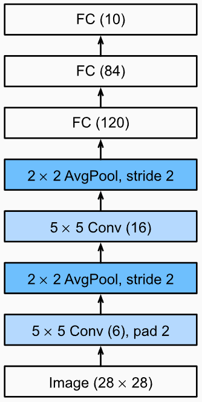
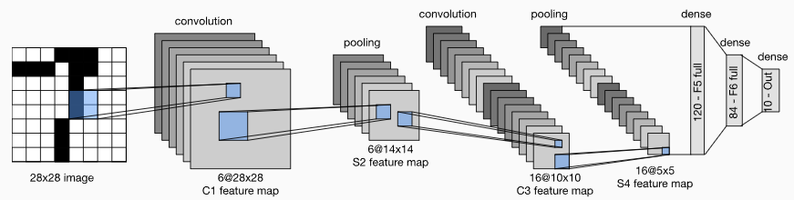
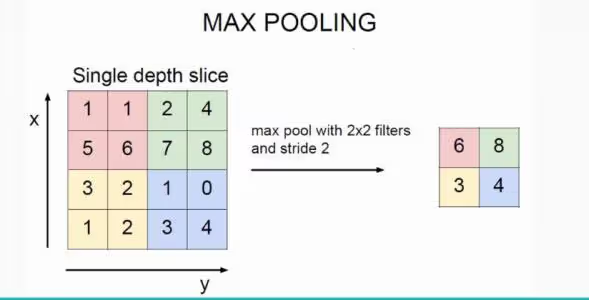
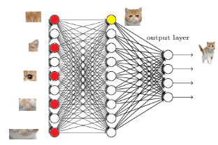
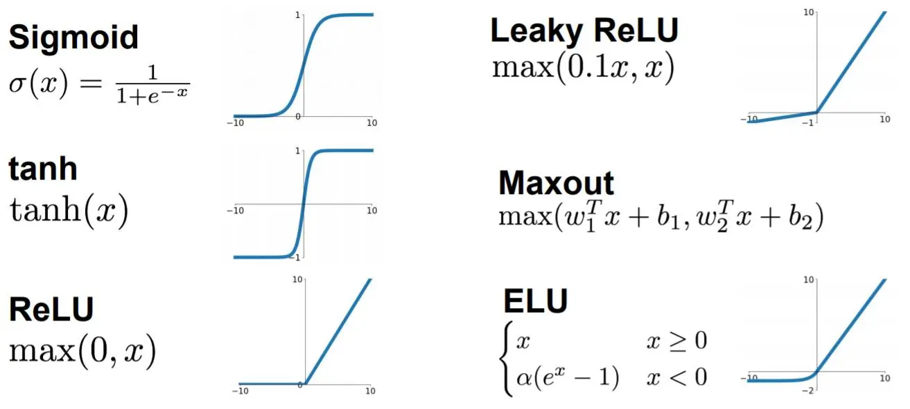
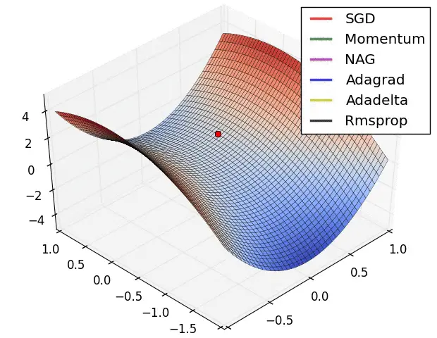

# pyTorch 入门

本仓库主要分为两个部分,三个重要的文件  
(点击下面的文件名跳转)  
1. pyTorch的基础知识 - 个人整理笔记--[Tutorial.md](./Tutorial.md)  (为方便阅读,已经嵌入到本页面文档的下面部分)
   
2. pyTorch的实战项目 - "基于LeNet的CIFAR10图像分类"的代码实现
   - 一键跑通简单版  
    [CIFAR10_Resnet18(pretrain).ipynb](./CIFAR10_Resnet18(pretrain).ipynb)
   - 详细讲解版本  
    [CIFAR10_Lenet.ipynb](./CIFAR10_Lenet.ipynb)

<br>  

---   

- 推荐新手使用[google colab](https://colab.google/)的在线服务器运行notebook,不需要配置环境,直接运行,非常方便.  
- 若有疑问欢迎提出issue,  
或直接联系我的邮件: `ricardo.hyl666@gmail.com`,一起讨论学习.

<br>

---

## Tutorical.md  
## 基于`LeNet`的`CIFAR-10`图像分类  
_pytorch代码入门(自定义`Dataset`类 和 `LeNet`网络模型)_

## 前提准备
- 实验环境   
    python == 3.8.18  
    pytorch  == 2.1.0  
    torchvision == 0.16.0  
    numpy == 1.19.5

- 数据集"CIFAR-10"下载并解压  
 1. 方法一:Ubuntu命令  
     ```shell
     # 下载  
     wget https://www.cs.toronto.edu/~kriz/cifar-10-python.tar.gz  
     # 解压  
     tar -xzvf cifar-10-python.tar.gz    
     ```
 2. 方法二:Python代码  
     ```python
     import torchvision
     train_dataset = torchvision.datasets.CIFAR10(root='./data', train=True, download=True)
     ```

## 数据集 ***CIFAR-10***
- 数据集文件结构
 ```shell
 cifar-10-batches-py/
     data_batch_1
     data_batch_2
     data_batch_3
     data_batch_4
     data_batch_5
     test_batch
     batches.meta
 ```
- 数据集文件说明
 - `data_batch_1/2/3/4/5`  
     五个训练批次，每个批次包含10000张图像，图像大小为32x32，共有10个类别  
 - `test_batch`  
     一个测试批次，包含10000张图像，图像大小为32x32，共有10个类别  
 - `batches.meta`  
     一个Python字典，包含了类别标签的名称

## PyTorch代码详解
### 一, 数据集类 Dataset  
 自定义数据集类  `class CIFAR10Dataset(Dataset)`  
 用于加载和处理CIFAR-10数据集

 共分为三个函数部分:
1. `__init__(self, root_dir, train=True, transform=None)`  
     ***"与每个特定数据集的文件结构有关，决定如何读取并处理数据，用于训练"***
   
     1. CIFAR-10的数据分为**五个训练批次**和**一个测试批次**，遍历文件`data_batch_1/2/3/4/5`  
     2. 使用`dict = pickle.load(...)`读取并将数据追加到两个重要类属性  
               ***self.data*** 和 ***self.labels***  
     3. 处理图像数据格式  
         ```python
         self.data = torch.cat([torch.tensor(d).view(-1, 3, 32, 32) for d in self.data])
         ```
        - `view`用于将从文件中读取到的**一维数组形式**转换为**四维tensor（[N,C,H,W]）**
             - 第一个维度N表示每个批次中的图像数量；  
             - 此处批次大小N=-1,代表自动计算第一维的大小。  
        - `cat`方法沿着第0维(即，批次大小维度N)，连接每个批次对应的**4维tensor**
             目的，  
             为了将CIFAR-10数据集中分散在多个批次的数据合并成一个单一，连续的数据集   
   
2. `len(self)`  
     获取数据集大小  
3. `getitem(self, idx)`  
    1. 通过标签`idx`来访问数据集的单个样本(图像和标签)  
    2. 图像数据(tensor格式)转换为PIL图像格式  
         ```python
         image = Image.fromarray(image.numpy().transpose((1, 2, 0)))
         ```   
         其中，  
         - `image.numpy()`将`image`的类型从PyTorch张量转换为NumPy数组
         - `.transpose((1,2,0))`改变数组的维度顺序，  
         从[c, h, w] 转换为 [h, w, c], 适应于PIL图像库格式
         - `Image.fromarray()`创建一个PIL图像对象  
     3. 使用传入的变量`transform`进行数据增强预处理   

### 二, 数据预处理和增强 transform
 - 数据增强包括各种调整大小、裁剪、数据增强等操作的函数  
     - **一般情况下，数据增强操作在训练集上使用，而测试集上不使用**
 - 两个必要的数据预处理操作是
     - 将PIL图像转换为PyTorch张量,  
         `transforms.ToTensor()`  
         \* 同时也自动将图像数据从`[0-255]`的范围缩放到`[0-1]`的范围(*归一化*)，  
         \* 并将数据格式从[H, W, C]转换为[C, H, W]  
            
     - 将张量标准化  
         `transforms.Normalize(mean, std)`  
         \* 图像数据大小从`[0,1]`缩放到`[-1,1]`
         \* 使所有特征都是中心化的且具有相同的尺度

            
      $$ \text{image} = \frac{\text{image} - \text{mean}}{\text{std}} $$  
            
  

### 三, 数据加载器 DataLoader
 `DataLoader` 是一个预先定义好的类，设计与`Dataset`类配合使用，便于高效地加载数据集
 ```python
 DataLoader(trainset, batch_size=16, shuffle=True, num_workers=4)
 ```      
 - `batch_size`  控制批次大小  
 - `shuffle` 是否在每个epoch打乱数据  
 - `num_workers` 使用多少进程加载数据   

### 四, 定义训练模型CNN  

```python
class LeNet(nn.Module):
    def __init__(self):
        super(LeNet, self).__init__()
        self.conv1 = nn.Conv2d(3, 6, 5)
        ...
        self.pool = nn.MaxPool2d(2,2)
        self.fc1 = nn.Linear(16*5*5, 120) 
        self.relu = nn.ReLU()
        ...
    def forward(self, x):
        out = self.conv1(x)
        ...
        out = self.pool(out)
        out = out.view(-1, 16*6*6)
        out = self.fc1(out)
        out = self.relu(out)
        ...
        return out
```   

- 继承于`nn.Module`的网络模型类`class LeNet(nn.Module)`包含两个自定义函数  
    1. `def __init__(self)`    
    定义网络结构,包含具体的卷积层,池化层,全连接层,激活函数等的定义(参数) 
    2. `def forward(self, x)`  
    定义了数据通过网络的方式 ,即调用网络结构的各种方法(层)的顺序
- 本文最后有以简单的CNN网络模型LeNet为例子进行具体讲解每一层的作用

### 五, 损失函数 Loss Function

> 损失函数是衡量模型**预测值**与**真实值**之间的差异。  

#### 使用方法--交叉熵损失 CrossEntropyLoss
用于分类问题的一种常用损失函数。它量化了两个概率分布之间的差异：  
1. 模型的预测输出  
2. 实际的标签

#### 代码例
```python
criterion = nn.CrossEntropyLoss()
loss = criterion(outputs, labels)
```

### 六, 优化器 Optimizer
> 给定一堆模型参数 $\theta$ ，还有一个损失函数 $J(\theta)$，目标是找到 $J(\theta)$ 的最小值。  

#### 模型实例化和Adam优化器的代码示例

```python
model = LeNet()
optimizer = torch.optim.Adam(model.parameters(), lr=0.001)
```

- 优化器关注于两点  
    1. **梯度方向**,在优化器中反映为梯度 $g_t$
    2. **步长大小**,在优化器中反映为学习率 $\alpha$   

### 七, 模型训练和评估
```python
for data , label in enumerate(trainloader, 0):
  optimizer.zero_grad ()    # 清空每个神经元的梯度grad

  # forward pass and backward pass
  output = network(data)    # 神经网络用输入算一遍结果
  loss = criterion(outputs , labels) # 损失函数衡量两个分布的相似度
  loss.backward ()          # 根据损失函数反向传播 更新每个神经元的梯度grad

  optimizer.step ()         # 根据每个神经元的梯度grad和优化器的规则 更新每个神经元的weight
  ```


### 八, 保存和加载模型

#### 两种方法:
1. 保存整个模型(包括模型的架构、参数和优化器状态)
2. 保存模型的状态字典(模型的参数),不包括模型的整个定义

    其中常用的为**保存状态字典**  
    - 保存状态字典更为灵活，因为它不依赖于模型的具体实现代码  
    - 只需要在加载时提供相同的模型架构
    - 具有在不同环境中运行的兼容性

#### 代码示例

```python
# 保存整个模型
torch.save(model(), 'lenet_model.pth')
# 加载模型
model(torch.load('lenet_model.pth'))

/****************************************************/

# 保存模型的状态字典
torch.save(model.state_dict(), 'lenet_state_dict.pth')
# 需要重新定义模型
model = LeNet()
# 加载状态字典
model.load_state_dict(torch.load('lenet_state_dict.pth'))
```

## 可视化模型验证结果


## CNN网络模型 -- ***LeNet*** (详解)
>本节通过一个发布于1989年的CNN网络模型: **LeNet** 来学习CNN模型每个层的意义与用法  
具体包含 **卷积层,池化层,全连接层** 和 **激活函数**  
参考[1] https://pytorch.zhangxiann.com/3-mo-xing-gou-jian/3.2-juan-ji-ceng
<p align='center'>

</p>
 
1. ###  二维卷积 nn.Conv2d()
    - 将一个图像(输入)和一个模板(卷积核)进行卷积操作，得到一个新的图像(输出)  
    - *涉及跨通道的加权求和运算,因为* ***每个卷积核与输入图像卷积得到一个特征(通道数),所以卷积核数量等于输出的通道数***
    - 本质是一种加权求和运算，把一个点的像素用周围点的加权平均代替  
    - 目的是为了 **消除噪声,增强特征**  

    #### 代码示例
    ```python  
    nn.Conv2d(self, in_channels, out_channels, kernel_size, stride=1,padding=0,)
    ```
    - stride：步长
    - padding：填充宽度，主要是为了调整输出的特征图大小，一般保持输入和输出的图像尺寸不变

    #### 卷积尺寸计算  
    假设输入图片大小为 $ I \times I$，卷积核大小为 $k \times k$，stride 为 $s$，padding 的像素数为 $p$，图片经过卷积之后的尺寸 $ O $ 如下：  
    $$O = \displaystyle\frac{I -k + 2 \times p}{s} +1$$  
    下面例子的输入图片大小为 $5 \times 5$，卷积大小为 $3 \times 3$，stride 为 1，padding 为 0，所以输出图片大小为:  
    $$O = \displaystyle\frac{5 -3 + 2 \times 0}{1} +1 = 3$$  
    #### 图例
<p align='center'>

</p>

##### 计算示例 网络模型中的卷积层输出尺寸
```python
class LeNet(nn.Module):
  def __init__(self):
      super(LeNet, self).__init__()
      self.conv1 = nn.Conv2d(3, 6, 5)                     
      self.conv2 = nn.Conv2d(6, 16, 5)
      self.pool = nn.MaxPool2d(kernel_size=2, stride=2)   
      self.fc1 = nn.Linear(16 * 5 * 5, 120)           
      self.fc2 = nn.Linear(120, 84)
      self.fc3 = nn.Linear(84, 10)
```
1. 第一个卷积层 (self.conv1):  
  - 这层使用了一个 3x3 的卷积核。这个尺寸决定了卷积后输出特征图的尺寸。  
  在LeNet中，通常假设stride为1且无padding，所以每次卷积操作后，特征图的尺寸会缩小 
  - 例如，输入图像大小为 `32x32`，经过此层后尺寸将变为 `28x28` (因为 `32-5+1=28`)

2. 第一个池化层 (self.pool):   
  - 使用 2x2 窗口的最大池化层会将特征图的高度和宽度各减半  
  - 经过池化后，特征图的尺寸会从 `28x28` 变为 `14x14`

3. 第二个卷积层 (self.conv2): 
  - 使用一个 5x5 的卷积核。应用于池化后的特征图，它会进一步减小尺寸  
  - 输入尺寸是 `14x14`，输出将是 `10x10`（因为 `14-5+1=10`） 

4. 第二个池化层(self.pool): 
  - 再次应用 2x2 最大池化，尺寸将再次缩小一半
  - 从 `10x10` 变为 `5x5`

5. 第一个全连接层 (self.fc1): 
  - 这里的输入特征数为 `16 * 5 * 5`。
  - 这个 `5x5` 是由于上面步骤中卷积和池化操作对特征图尺寸的影响而来。总共有 `16*5*5` 个特征需要被全连接层处理  
#### 图例
<p align='center'>

</p>

2. ### 池化层(下采样层) Pooling(Downsampling)
    > 常用 *`最大池化`* 与 *`平均池化`*，本文介绍 最大池化 Max Pooling
    - 正向传播时，选择图像区域中最大值作为该区域池化后的值  
    反向传播时，梯度传给最大值位置，其他区域梯度设为0
    - 模拟人的视觉对数据进行降维，用更高层次的特征表示图像
    - 目的：
        - 保留主要特征，减少参数和计算量，防止过拟合
        - 提升invariance(不变性)，这种不变性包括translation(平移)，rotation(旋转)，scale(尺度)  
    #### 图例
<p align='center'>

</p>

    #### 代码示例
    ```python
    nn.MaxPool2d(kernel_size=2, stride=2, padding=0)
    ```
    - kernel_size：池化窗口大小
    - stride：步长
    - padding：填充

3. ### 全连接层 nn.Linear()
    - 对输入特征进行线性变换。
    - 在这一层中，每个输入节点都与下一层的每个节点相连,用于整合提取的特征
    - *把分布式特征representation映射到样本标记空间*
    - 将卷积层三维的输出转换成一维形式 (16 * 5 * 5 -> 1 * 120)
    - 实际运算为,使用一个`16 * 5 * 5 * 120`的卷积层去卷积上一层

    #### 代码示例
    ```python
    nn.Linear(in_features, out_features, bias=True)
    ```
    - in(out)_features：输入(输出)特征数
    - bias：是否使用偏置

    #### 图例
<p align='center'>

</p>

- 红色为激活状态   
- 两层fc全连接层用于整合提取到的特征,用于最终分类

4. ### 激活函数 nn.ReLU()
    - `ReLU`全称为"Rectified Linear Unit"(修正线性单元),是最常用的激活函数
    - 数学定义 $$ReLU(x)=max(0,x)$$
    - 优点:  
        1. 减轻梯度消失问题:
            正区间内,导数为常数 `1` ,助于减轻深层网络的梯度消失问题
        2. 稀疏激活性: ReLU()在负区间输出为 `0` ,在网络的激活模式中引入稀疏性  
    - 缺点:  
        "死亡ReLU问题": 训练过程中,若一个神经元的输出始终为负,则该神经元可能再也不会被激活,可能导致数据的部分信息丢失
    #### 代码示例
    ```python
    output = nn.ReLU(input)
    ```
    #### 图例
    下图给出了多种常用的激活函数,其中最简单也是最常用的便是`ReLU()`
<p align='center'>

</p>
    

## 优化器 Optimizer (详解)
> 优化器是在深度学习`反向传播`过程中,指引`损失函数(目标函数)`的各个参数往正确的方向更新适合的大小,  
使得更新后的各个参数让损失函数(目标函数)值不断`逼近全局最小 `  
参考:   
[1] https://zhuanlan.zhihu.com/p/569138458  
[2] https://pytorch.zhangxiann.com/4-mo-xing-xun-lian/4.3-you-hua-qi  
[3] https://zhuanlan.zhihu.com/p/261695487  

- 优化器关注于两点  
    1. **梯度方向**,在优化器中反映为梯度 $g_t$
    2. **步长大小**,在优化器中反映为学习率 $\alpha$   

### 

### 介绍几个主要使用的优化器
#### 1. 随机梯度下降法(Stochastic Gradient Descent，SGD)  
> 随机梯度下降算法每次从训练集中随机选择一个样本来进行学习    

参数更新方式:  
- 下一次参数 = 前一次参数 - 下降梯度=学习率 * 当前参数的梯度:
$$w_{t+1} = w_t - \eta_t = w_t - \alpha \cdot g_t $$
#### 1.2 SGD with Momentum (SGDM)
> 为了解决局部最优点或鞍点问题,引入惯性动量 `momentum`
- 即下坡的时候,若为陡坡,则利用惯性跑的快一些
- 在SGD基础上引入**一阶动量**
    $$m_t = \beta_1 \cdot m_{t-1} + (1 - \beta_1) \cdot g_t $$
    - 其中 动量系数 $\beta$ 通常被设置为 `0.9`,意味着前一步的动量 $m_{t-1} $有很大的影响力
    - t 时刻的下降方向，不仅由当前点的梯度方向决定，而且由此前累积的下降方向决定
- `SGDM`参数更新公式:
$$w_{t+1} = w_t - \alpha \cdot m_t$$
- `SGDM`代码示例  
    ``` python
    optimizer = optim.SGD(model.parameters(), lr=0.001, momentum=0.9)
    ```
#### 2. 自适应学习率算法 Adagrad
- SGD方法总是以相同的学习率去跟新所有参数
- Adagrad可以自动更新(缩小)学习率
#### 4. 窗口法的学习率差异化 RMSprop
- 为了解决Adagrad的问题"学习率逐渐收敛到 0,训练直接结束"
- Adagrad用了从初始时刻到目前时刻的**全部梯度信息**,那么RMSprop只用部分梯度信息(只用上一时刻和这一时刻)
- 因此,学习率的更新受之前学习率的影响就小了很多,避免学习率收敛
- 此方法称为指数移动平均法,也称为"窗口法"

#### 5. 自适应学习率算法 Adam
> 集大成者(RMSprop+momentem)  
这个是目前最常用的优化器，因为它可以使用较大的初始学习率。 

- 通过一阶动量和二阶动量，有效控制学习率步长和梯度方向，防止梯度的振荡和在鞍点的静止 

- `Adam`代码示例
    ```python
    optimizer = torch.optim.Adam(model.parameters(), lr=0.001)
    ```
#### 图例
下图给出了一个损失函数的鞍点情况特例,用于直观比较各个optimizer优化方法
<p align='center'>

</p>

### 选择优化器小结
在模型设计实验过程中，要快速验证新模型的效果，可以先用Adam进行快速实验优化；  
在模型上线或者结果发布前，可以用精调的SGD进行模型的极致优化。

## 损失函数 Loss Function

> 损失函数是衡量模型**预测值**与**真实值**之间的差异。  

我们还经常听到代价函数和目标函数，它们之间差异如下：  
- 损失函数(Loss Function)是计算一个样本的模型输出与真实标签的差异  
Loss $=f\left(y^{\wedge}, y\right)$  
- 代价函数(Cost Function)是计算整个样本集的模型输出与真实标签的差异，是所有样本损失函数的平均值  
$\cos t=\frac{1}{N} \sum_{i}^{N} f\left(y_{i}^{\wedge}, y_{i}\right)$  
- 目标函数(Objective Function)就是代价函数加上**正则项**(控制模型的复杂度，从而防止过拟合)   

#### 1. 均方误差 MSELoss
```python
criterion = nn.MSELoss(reduction='none')
```
- 数学式  

    $$MSE = \frac{1}{N} \sum_{i=1}^{N} (y_i - \hat{y}_i)^2$$
    - $y_i$ 是真实值
    - $\hat{y}_i $ 是模型对第 i 个样本的预测值

#### 2. 交叉熵损失 / 对数损失 CrossEntropyLoss
> 目的是最小化模型预测的概率分布和实际标签的概率分布之间的差异  
内置了softmax()激活函数,把输出值归一化到了 [0,1] 之间    
误差大的时候，权重更新快；误差小的时候，权重更新慢

概率对数：使用预测概率的负对数 $(-\log(\hat{y}_{ic}))$ 是因为对数函数对于接近 1 的预测概率惩罚较小，而对于接近 0 的预测概率惩罚较大。这意味着如果模型对实际标签的预测概率高，则损失小；如果预测概率低，则损失大。  


- 代码例
```python
loss_fn = nn.CrossEntropyLoss()
loss = loss_fn(outputs, labels)
```
- 数学式(**多分类**情况)
    $$H(y, \hat{y}) = -\sum_{i=1}^{N} \sum_{c=1}^{C} y_{ic} \log(\hat{y}_{ic})$$ 
 - c : 是分类标签
 - $ y_{ic} $：表示第 i 个样本属于类别 c 的真实标签。

## 参考
[1] https://pytorch.zhangxiann.com/  
[2] https://zhuanlan.zhihu.com/p/261695487  
[3] https://zhuanlan.zhihu.com/p/569138458

## 鸣谢
感谢来自李师兄的push,没有他就没有这篇笔记的整理与总结
